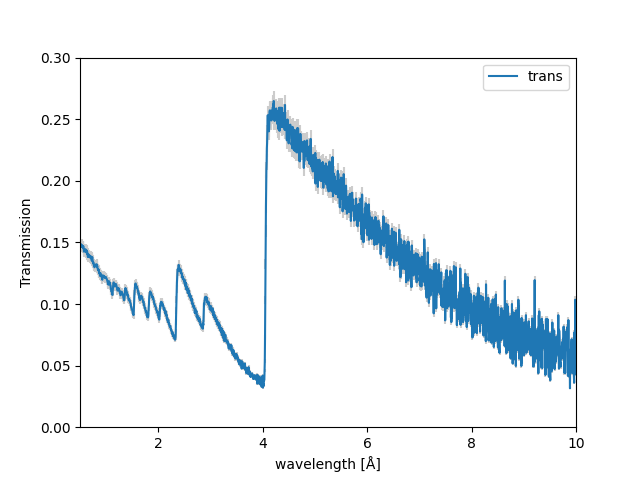
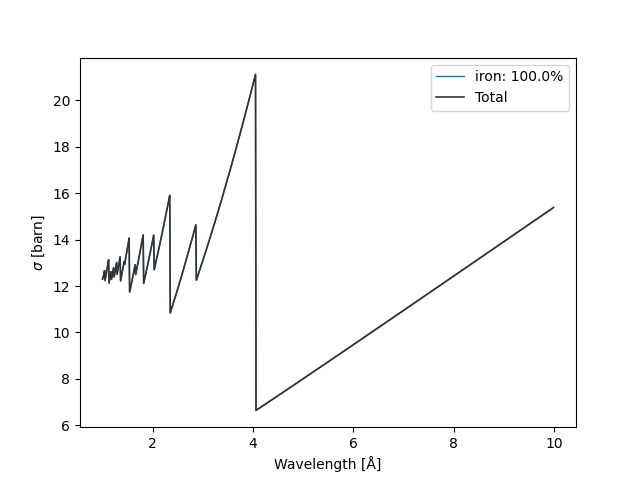

===================
Iron Powder Example
===================

This example demonstrates how to use nbragg to analyze neutron transmission through an iron powder sample.

Dataset Overview
----------------

The iron powder example showcases the analysis of Bragg edges in a polycrystalline iron sample. We'll walk through the entire process from data loading to fitting and interpretation.

Data Preparation
----------------

First, load the transmission data and use the `.plot` method to plot and inspect the data.

.. code-block:: python

    import nbragg

    # Load transmission data
    data = nbragg.Data.from_transmission("iron_powder.csv")
    data.plot()

The user can also inspect the data in a table format by calling:

.. code-block:: python

    data.table

+----+-------------+----------+---------+
|    | wavelength  | trans    | err     |
+====+=============+==========+=========+
|  0 | 0.501098    | 0.148315 | 0.004449|
+----+-------------+----------+---------+
|  1 | 0.505493    | 0.147728 | 0.004432|
+----+-------------+----------+---------+
|  2 | 0.509889    | 0.147725 | 0.004432|
+----+-------------+----------+---------+
|  3 | 0.514284    | 0.148043 | 0.004441|
+----+-------------+----------+---------+
|  4 | 0.518680    | 0.148369 | 0.004451|
+----+-------------+----------+---------+

Cross-Section Configuration
---------------------------

We'll use the NCrystal cross-section for alpha-iron and use the `.plot` method to visualize the cross-section:

.. code-block:: python

    # Define iron cross-section
    xs = nbragg.CrossSection.from_material("Fe_sg229_Iron-alpha.ncmat")
    xs.plot()

Model Creation and Fitting
--------------------------

Create a transmission model with background and response variations:

.. code-block:: python

    # Create transmission model
    model = nbragg.TransmissionModel(
        xs, 
        vary_background=True, 
        vary_response=True
    )

    # Perform fitting
    result = model.fit(data)

Visualization
-------------

Display the fit results using the command:

.. code-block:: python

    result.plot()

.. image:: iron_powder_fit.png
   :width: 80%
   :align: center

To visualize the instrumental response after fitting, use:

.. code-block:: python

    model.response.plot(params=result.params)

.. image:: iron_powder_response.png
   :width: 80%
   :align: center

Fit Summary
-----------

In a Jupyter Notebook, typing `result` displays the following fit summary as an interactive HTML table:

Fit Result
==========

Model: Model(transmission)

Fit Statistics
--------------

+-----------------------+-------------------+
| Fitting Method        | leastsq           |
+-----------------------+-------------------+
| # Function Evals      | 57                |
+-----------------------+-------------------+
| # Data Points         | 1138              |
+-----------------------+-------------------+
| # Variables           | 7                 |
+-----------------------+-------------------+
| Chi-square            | 1728.82713        |
+-----------------------+-------------------+
| Reduced Chi-square    | 1.52858279        |
+-----------------------+-------------------+
| Akaike Info Criterion | 489.878468        |
+-----------------------+-------------------+
| Bayesian Info Crit.   | 525.137662        |
+-----------------------+-------------------+
| R-squared             | -345.832688       |
+-----------------------+-------------------+

Parameters
----------

+-------------+------------+-----------------+----------------+----------------+-----------+-----------+-------+
| Name        | Value      | Standard Error  | Relative Error | Initial Value  | Min       | Max       | Vary  |
+=============+============+=================+================+================+===========+===========+=======+
| thickness   | 1.97199144 | 0.02039823      | (1.03%)        | 1.0            | 0.0       | 5.0       | True  |
+-------------+------------+-----------------+----------------+----------------+-----------+-----------+-------+
| norm        | 0.78300304 | 0.00980444      | (1.25%)        | 1.0            | 0.1       | 10.0      | True  |
+-------------+------------+-----------------+----------------+----------------+-----------+-----------+-------+
| temp        | 300.000000 | 0.00000000      | (0.00%)        | 300.0          | 77.0      | 1000.0    | False |
+-------------+------------+-----------------+----------------+----------------+-----------+-----------+-------+
| α1          | 2.58192159 | 0.06909434      | (2.68%)        | 3.67           | 0.001     | 1000.0    | True  |
+-------------+------------+-----------------+----------------+----------------+-----------+-----------+-------+
| β1          | 3.82826196 | 0.12721525      | (3.32%)        | 3.06           | 0.001     | 1000.0    | True  |
+-------------+------------+-----------------+----------------+----------------+-----------+-----------+-------+
| b0          | -0.0221435 | 0.00722197      | (32.61%)       | 0.0            | -1e6      | 1e6       | True  |
+-------------+------------+-----------------+----------------+----------------+-----------+-----------+-------+
| b1          | 0.00684805 | 0.00222445      | (32.48%)       | 0.0            | -1e6      | 1e6       | True  |
+-------------+------------+-----------------+----------------+----------------+-----------+-----------+-------+
| b2          | 0.03639802 | 0.00512610      | (14.08%)       | 0.0            | -1e6      | 1e6       | True  |
+-------------+------------+-----------------+----------------+----------------+-----------+-----------+-------+

Correlations
------------

+----------------+----------------+-------------+
| Parameter 1    | Parameter 2    | Correlation |
+================+================+=============+
| b0             | b1             | -0.9968     |
+----------------+----------------+-------------+
| thickness      | norm           | +0.9825     |
+----------------+----------------+-------------+
| b0             | b2             | -0.9725     |
+----------------+----------------+-------------+
| b1             | b2             | +0.9670     |
+----------------+----------------+-------------+
| α1             | β1             | +0.6106     |
+----------------+----------------+-------------+
| norm           | b0             | +0.5964     |
+----------------+----------------+-------------+
| norm           | b1             | -0.5791     |
+----------------+----------------+-------------+
| thickness      | b0             | +0.5467     |
+----------------+----------------+-------------+
| thickness      | b1             | -0.5268     |
+----------------+----------------+-------------+
| norm           | b2             | -0.4251     |
+----------------+----------------+-------------+
| thickness      | b2             | -0.3591     |
+----------------+----------------+-------------+
| α1             | b2             | +0.1194     |
+----------------+----------------+-------------+
| α1             | b1             | +0.1181     |
+----------------+----------------+-------------+
| α1             | b0             | -0.1071     |
+----------------+----------------+-------------+

Key Observations
----------------

- The iron powder sample shows multiple Bragg edges
- Variations in background and instrumental response are accounted for
- The model provides insights into material structure

Additional Notes
----------------

- Ensure you have the correct NCrystal material file
- Calibrate your instrumental response carefully
- The quality of fitting depends on data resolution
