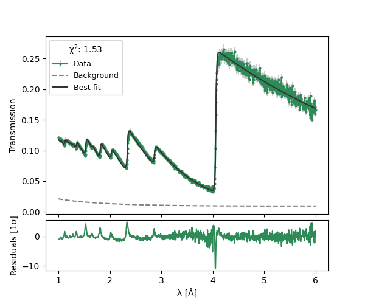

=======================
nbragg Documentation
=======================

Overview
--------

nbragg is a powerful Python package designed for advanced analysis of neutron Bragg edge data using NCrystal cross-sections. It provides researchers and scientists with a comprehensive toolset for in-depth neutron transmission research.

Key Features
------------

- **Advanced Cross-Section Calculations**: Seamless integration with NCrystal for precise material cross-section modeling
- **Flexible Response Modeling**: Built-in tools for instrument response and background function estimation
- **Powerful Fitting Capabilities**: Leveraging lmfit for sophisticated, non-linear parameter optimization
- **Versatile Material Analysis**: 
  * Support for non-oriented powder samples
  * Multi-phase oriented material characterization
- **Comprehensive Visualization**: Integrated plotting utilities for intuitive data representation
- **Pythonic Design**: Clean, intuitive API for ease of use

Getting Started
---------------

.. toctree::
   :maxdepth: 2
   :caption: Documentation Contents:

   installation
   quickstart
   examples/iron_powder
   api/index
   license

Quick Links
-----------

- `GitHub Repository <https://github.com/TsvikiHirsh/nbragg>`_
- `PyPI Package <https://pypi.org/project/nbragg/>`_

Indices and Tables
==================

* :ref:`genindex`
* :ref:`modindex`
* :ref:`search`

Citing nbragg
-------------

If you use nbragg in your research, please cite our package and provide a link to the GitHub repository.